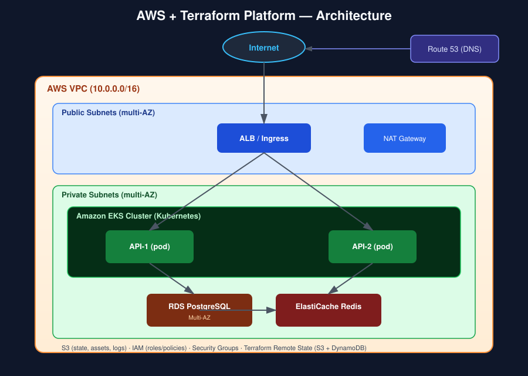
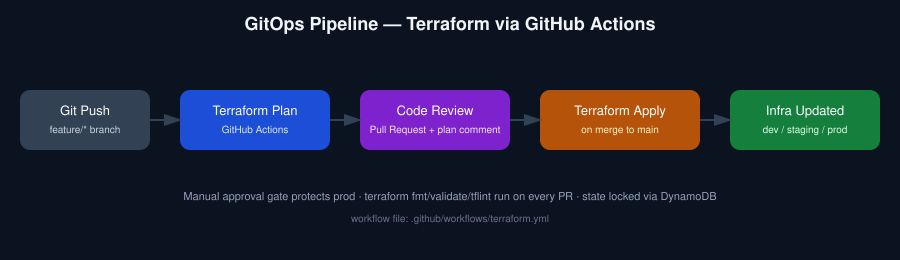
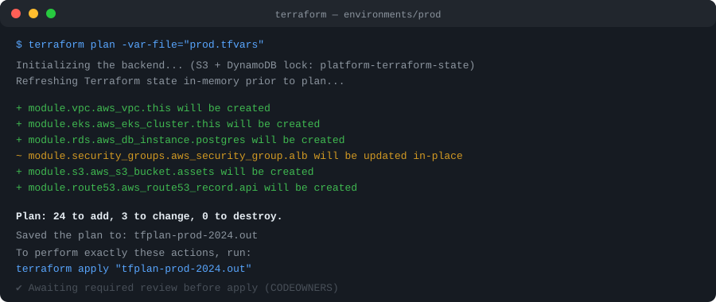

# Plataforma AWS + Terraform

[](.github/workflows/terraform.yml)
[](.github/workflows/app-ci.yml)
[](LICENSE)
[](terraform)
[](terraform)

🇺🇸 **Read this in English: [README.md](README.md)**

Uma infraestrutura AWS completa e totalmente modular — construída inteiramente com Terraform — que provisiona uma VPC, um cluster EKS, PostgreSQL, cache Redis e um load balancer com ingress para duas APIs de exemplo. As mudanças de infraestrutura passam por um pipeline GitOps de verdade: **plan → review → apply**, nunca um `terraform apply` manual no notebook de alguém.

## O que este projeto prova

Este repositório existe para demonstrar, na prática, domínio da stack que aparece em praticamente toda vaga de infraestrutura/DevOps atualmente: **módulos Terraform, remote state, workspaces/ambientes e networking & IAM na AWS** — nada de exemplo de brinquedo, e sim uma estrutura que poderia ser entregue a um time amanhã.

## Arquitetura



```
                    Internet
                       |
                 ALB / Ingress
                       |
                 Kubernetes (EKS)
                  /        \
              API-1       API-2
                 \          /
                  PostgreSQL
                       |
                    Redis
```

| Camada | Serviço AWS | Módulo Terraform |
|---|---|---|
| Rede | VPC, subnets públicas/privadas, NAT, IGW | `terraform/modules/vpc` |
| Identidade | Roles e policies IAM (privilégio mínimo) | `terraform/modules/iam` |
| Computação | Cluster EKS + node group gerenciado | `terraform/modules/eks` |
| Banco de dados | RDS PostgreSQL (Multi-AZ em prod) | `terraform/modules/rds` |
| Armazenamento de objetos | S3 (criptografado, versionado, privado) | `terraform/modules/s3` |
| Load balancing | Application Load Balancer | `terraform/modules/alb` |
| Segurança de rede | Security Groups (ingress de privilégio mínimo) | `terraform/modules/security-groups` |
| DNS | Registro alias no Route 53 | `terraform/modules/route53` |
| Estado | Backend S3 + travas via DynamoDB | `terraform/bootstrap` |

## O pipeline (o verdadeiro diferencial)

Aqui ninguém roda `terraform apply` manualmente. Toda mudança de infraestrutura passa pelo GitHub Actions:



1. **Git push** em uma branch de feature que altera `terraform/**`.
2. **Terraform Plan** roda automaticamente para `dev`, `staging` e `prod`, e é publicado como comentário no Pull Request.
3. **Code review** — uma pessoa (via CODEOWNERS) revisa o plano antes do merge.
4. **Terraform Apply** roda no merge para `main`, protegido por ambiente através de uma regra de aprovação manual do [GitHub Environments](https://docs.github.com/pt/actions/deployment/targeting-different-environments/using-environments-for-deployment) (crítico em `prod`).
5. **Infra atualizada** — o state permanece travado e versionado em S3 + DynamoDB o tempo todo.

Exemplo de saída do plan publicada pela CI:



## Estrutura do repositório

```
aws-terraform-platform/
├── terraform/
│   ├── bootstrap/            # execução única: cria o backend remoto S3 + DynamoDB
│   ├── modules/               # vpc, iam, eks, rds, s3, alb, security-groups, route53
│   └── environments/
│       ├── dev/
│       ├── staging/
│       └── prod/              # cada um com seu backend.tf, variables.tf e tfvars
├── app/
│   ├── api-1/                 # serviço de exemplo em Node.js/Express (items)
│   └── api-2/                 # serviço de exemplo em Node.js/Express (orders)
├── kubernetes/
│   ├── base/                  # Deployment, Service, Ingress, ConfigMap, HPA
│   └── overlays/{dev,staging,prod}/  # overrides por ambiente via Kustomize
├── .github/workflows/          # terraform.yml (infra) + app-ci.yml (lint/test)
├── docker-compose.yml          # roda api-1 + api-2 + postgres + redis localmente
├── docs/images/                 # diagramas de arquitetura e pipeline
└── scripts/                     # bootstrap-remote-state.sh, plan.sh, apply.sh
```

## Tecnologias utilizadas

- **Terraform** ≥ 1.7 (módulos, remote state, configuração por ambiente)
- **AWS**: VPC, EKS, RDS (PostgreSQL), ElastiCache (Redis), S3, ALB, IAM, Security Groups, Route 53, DynamoDB
- **Kubernetes** (via EKS) com overlays Kustomize
- **Node.js 20 / Express** para os serviços de exemplo
- **GitHub Actions** para CI/CD
- **Docker / Docker Compose** para desenvolvimento local

## Como começar

### Pré-requisitos

- [Terraform](https://developer.hashicorp.com/terraform/downloads) ≥ 1.7
- Uma conta AWS com credenciais configuradas (`aws configure` ou SSO)
- [Docker](https://docs.docker.com/get-docker/) e Docker Compose (para desenvolvimento local)
- `kubectl` e `kustomize` (para deploy no EKS)

### 1. Rodando as APIs de exemplo localmente (sem precisar da AWS)

```bash
git clone https://github.com/seu-usuario/aws-terraform-platform.git
cd aws-terraform-platform

cp app/api-1/.env.example app/api-1/.env
cp app/api-2/.env.example app/api-2/.env

docker compose up --build
```

- API-1: http://localhost:3001/items
- API-2: http://localhost:3002/orders
- Health check: `GET /health` em ambos os serviços

### 2. Provisionando a infraestrutura na AWS

```bash
# Execução única: cria o bucket S3 + tabela DynamoDB para o remote state
./scripts/bootstrap-remote-state.sh

# Copie e preencha as variáveis do ambiente desejado
cp terraform/environments/dev/terraform.tfvars.example terraform/environments/dev/terraform.tfvars

# Revise e então aplique
./scripts/plan.sh dev
./scripts/apply.sh dev
```

Repita para `staging` / `prod` conforme necessário. Na prática, `plan` e `apply` rodam pelo pipeline do GitHub Actions descrito acima, não a partir de uma máquina local.

### 3. Fazendo o deploy dos serviços no EKS

```bash
aws eks update-kubeconfig --name platform-dev-eks --region us-east-1
kubectl apply -k kubernetes/overlays/dev
```

## Variáveis de ambiente

Cada serviço documenta suas variáveis no próprio `.env.example` (`app/api-1/.env.example`, `app/api-2/.env.example`):

| Variável | Descrição |
|---|---|
| `PORT` | Porta em que o serviço escuta |
| `SERVICE_NAME` | Usado nos logs e na resposta de `/health` |
| `DB_HOST`, `DB_PORT`, `DB_NAME`, `DB_USER`, `DB_PASSWORD` | Conexão com PostgreSQL/RDS |
| `REDIS_HOST`, `REDIS_PORT` | Conexão com Redis/ElastiCache |

As variáveis do Terraform ficam em `terraform/environments/<env>/terraform.tfvars.example` — copie para `terraform.tfvars` (ignorado pelo git) e preencha com valores reais. **Nunca faça commit de `terraform.tfvars` ou `.env`.**

## Testes e qualidade de código

```bash
cd app/api-1 && npm install && npm run lint && npm test
cd app/api-2 && npm install && npm run lint && npm test
```

- `terraform fmt -check` e `terraform validate` rodam em todo Pull Request (veja `.github/workflows/terraform.yml`).
- ESLint roda em todo PR que altera `app/**` (veja `.github/workflows/app-ci.yml`).
- Nenhum segredo, token ou credencial é commitado — tudo sensível fica em arquivos `.tfvars`/`.env` ignorados pelo git, com templates `.example` versionados no lugar.

## Como contribuir

1. Faça um fork do repositório e crie uma branch a partir de `main`.
2. Faça sua alteração; rode `terraform fmt`/`terraform validate` e os testes da aplicação localmente.
3. Abra um Pull Request — a CI vai publicar o plano do Terraform como comentário.
4. Um code owner revisa o plano e o diff antes do merge.
5. No merge, o `apply` roda por ambiente (com aprovação manual para `prod`).

Veja o [CHANGELOG.md](CHANGELOG.md) para o histórico de versões.

## Licença

Distribuído sob a [Licença MIT](LICENSE).
